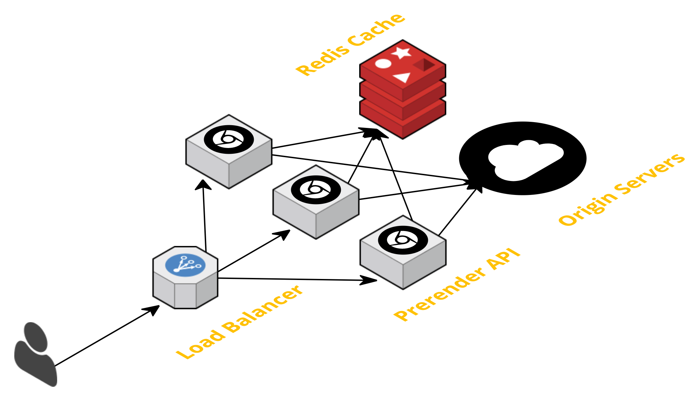

# Prerender

Prerender exposes a simple API that will pre-render webpages and return them. This is primarily useful for SEO purposes as search engines prefer full pages instead of the shells used by many single page apps (SPAs).

## Installation

prerender can be installed from source:

```
go get github.com/brycekahle/prerender
```

## Prerequisites

- Google Chrome 59+ (you may use [Chrome Canary](https://www.google.com/chrome/browser/canary.html) while headless Chrome is in beta)

OR
- Docker Compose

## Usage

By default, prerender will look for Chrome Canary at `/Applications/Google Chrome Canary.app/Contents/MacOS/Google Chrome Canary`.
You can override this by specifying the `CHROME_PATH` environment variable.

The `PORT` environment variable controls what port `prerender` listens on. The default value is `8000`.

```
$ prerender
```

Alternatively you can use Docker Compose to run the prerender service and a Redis server for caching:

```
docker-compose up
```

If you wish to scale the API to multiple instances, you may use the following command:

```
docker-compose scale prerender=2
```

Prerender exposes a simple HTTP API. Issue a `GET` request with the path set to the origin URL you wish to render. Example:

```
GET http://localhost:8000/https://netlify.com/
```

A timeout is enforced on the fetch and render of an origin URL. If the timeout is exceeded, a `504 Gateway Timeout` will be returned. The default timeout is 60 seconds. You may override it by specifying `RENDER_TIMEOUT` in a format [`time.ParseDuration`](https://golang.org/pkg/time/#ParseDuration) understands.

If `REDIS_URL` is specified, the API will cache results for 24 hours in Redis. The cache can be shared between multiple API instances to reduce duplicate requests.

## Design

Prerender acts as a proxy between the user and the origin URL, rendering the HTML and executing JavaScript on the page.
The HTML content of the page is captured when the [`load`](https://developer.mozilla.org/en-US/docs/Web/Events/load) event is fired.

The diagram below shows the design as currently implemented.



The API does not utilize any common Go frameworks for routing. Because of the simplicity of the request, using the core `http` lib only
should have some small performance benefit, but this has not been measured. The default `ServeMux` handler also had to be removed.
This was because of an undesirable behavior where `ServeMux` would redirect any request with two forward slashes `//` in a row, in the path, even if escaped.
This prevented proper functioning of the API. The URL structure could have been modified to utilize a query param.
This was not done to maintain backwards compatibility with the [existing API](https://github.com/netlify/prerender). Each request is logged with the method, URL, status code, duration in nanoseconds, and size in bytes of the response. A structured metric tracking system such as StatsD could be added with minimal effort.

[Headless Chrome](https://developers.google.com/web/updates/2017/04/headless-chrome) is used to fetch and render pages.
Chrome was chosen because of its up-to-date rendering engine, and reputation for great performance. A single process is launched and then
communicated with via the [Chrome DevTools Protocol](https://chromedevtools.github.io/devtools-protocol/). The built-in `--dump-dom` command line
flag was not sufficient because it did not capture any content outside of the `<body>` tag. In order to support multiple simultaneous requests,
it opens a new tab for each request. Using multiple Chrome processes at once may lead to an increase of throughput, but this should be measured.

[Redis](https://redis.io/) was chosen as a caching layer to store and retrieve previously rendered pages. The decision to use Redis was primarily based
on performance. It provides very fast operations and has well known scaling patterns.
AWS S3 could have been utilized to provide similar functionality. It is operationally simpler, but at the cost of performance. Using S3 would require using the `ETag` from S3 instead of the origin, if present.

The `cache` and `render` components were built as separate packages to ensure good separation of concerns.
Interactions are done through interfaces to support ease of testing for individual components.


### Caching

`ETag` and `If-None-Match` headers are utilized to support efficient caching.
If an `ETag` header is not returned from the origin, one will be generated by computing the MD5 hash of body.

## Future Considerations

- Add Google `_escaped_fragment_` support.
- Potentially remove of `<script>` tags from final output.
- Block images for better performance. Possible side-effect if page interacts with images in any way that depends on them loading.
- Adding a distributed lock so near-simultaneous requests to the same URL on different API nodes results in a single prerender operation.
- Respect `Cache-Control` header from origin to control cache TTL.
- Forward additional headers in addition to `ETag`.
- GZip content at rest in Redis. If `Accept` headers allow, can be returned to user without decompressing.
- Control over maximum number of open tabs in Chrome.
- Handle unexpected Chrome termination.
- Negative caching.
